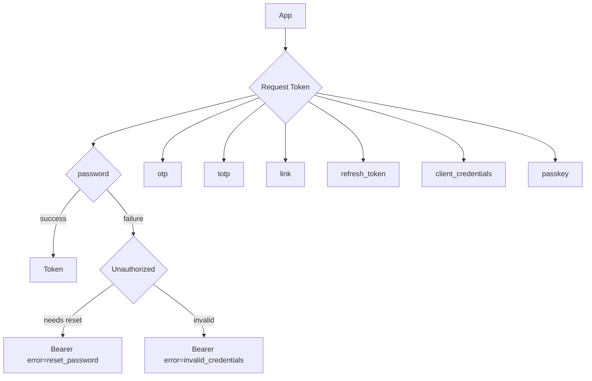
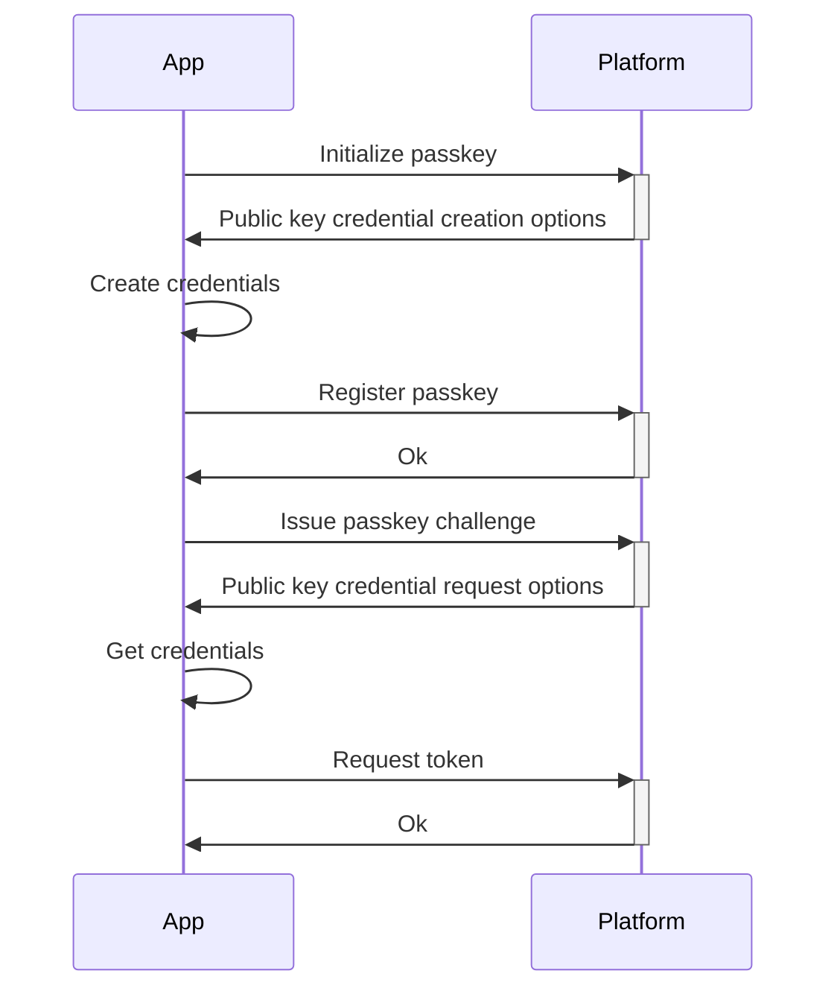

# Authentication

WIP

## Login



## Passkey

SEE: [navigator.credentials.create()](https://www.w3.org/TR/webauthn-2/#sctn-createCredential) and [navigator.credentials.get()](https://www.w3.org/TR/webauthn-2/#sctn-getAssertion) and [webauthn-json](https://github.com/github/webauthn-json)




### Create passkey factor

#### Initialize

**POST** `/identity/authorize/factors/initialize`
```json title=Request
{
  "factorType": "passkey"
}
```
&nbsp;
```json title=Response
{
  "options": "{\"allowCredentials\":[{\"id\":\"AUnfDtA+myCDdumkKnVp2Sk0MIWCPXQVL2mG3h+xQBvLEF+MmNqvj2ZwNIY8id5UHz7ogZKmGgc0mM9yYVhdJNU1n6nIwPBGUuZpr3N18trqXMKxejYYKwCO4BmSHA==\",\"type\":\"public-key\"},],\"challenge\":\"hYZtLNT9SIgZqPnKfbnQX3nCJ7NavTT_S6oC9XREYv0F\",\"rpId\":\"example.com\",\"timeout\":300000,\"userVerification\":\"discouraged\"}"
}
```

#### Register

**POST** `/identity/authorize/factors`
```json title=Request
{
  "factorType": "passkey",
  "value": "{\"type\":\"public-key\",\"id\":\"Ab6y28pCs5bVRIzSmrlufidfR57gRlEZ-KSTVGJYdkwAfR_SeaVXvdW6ND_XljM25cXYI-dSwrhjuNsj1L3uC0BHqN3mBQIzSswJneTv08RbDNZOLhjiwOEnQ03uPbL5eA7EcyinClOU_qwPMf5lowW1NSTWtaFvOlY\",\"rawId\":\"Ab6y28pCs5bVRIzSmrlufidfR57gRlEZ-KSTVGJYdkwAfR_SeaVXvdW6ND_XljM25cXYI-dSwrhjuNsj1L3uC0BHqN3mBQIzSswJneTv08RbDNZOLhjiwOEnQ03uPbL5eA7EcyinClOU_qwPMf5lowW1NSTWtaFvOlY\",\"response\":{\"clientDataJSON\":\"eyJ0eXBlIjoid2ViYXV0aG4uY3JlYXRlIiwiY2hhbGxlbmdlIjoiaFladExOVDlTSWdacVBuS2ZiblFYM25DSjdOYXZUVF9TNm9DOVhSRVl2MEYiLCJvcmlnaW4iOiJodHRwOi8vbG9jYWxob3N0OjMwMDAiLCJjcm9zc09yaWdpbiI6ZmFsc2V9\",\"attestationObject\":\"o2NmbXRmcGFja2VkZ2F0dFN0bXSiY2FsZyZjc2lnWEYwRAIgLEvyXrb_aMCVOjpYBLpm3cPaaquDN0ouXaL27SF9Lp0CIB2f56tWUDvs6oBl3pMxIIrJqJhZKkK7btJtWVDLsFFbaGF1dGhEYXRhWP5Jlg3liA6MaHQ0Fw9kdmBbj-SuuaKGMseZXPO6gx2XY0VheZqwrc4AAjW8xgpkiwsl8fBVAwB6Ab6y28pCs5bVRIzSmrlufidfR57gRlEZ-KSTVGJYdkwAfR_SeaVXvdW6ND_XljM25cXYI-dSwrhjuNsj1L3uC0BHqN3mBQIzSswJneTv08RbDNZOLhjiwOEnQ03uPbL5eA7EcyinClOU_qwPMf5lowW1NSTWtaFvOlalAQIDJiABIVggFCI-4HODPxlfeBwfFyzQG_btRm_pB6mb9E1E-rANMwoiWCBCr6C2SQOGElh9N9OMzVBcMnOolAcvz3S0STbnNTHOmg\"},\"clientExtensionResults\":{}}"
}
```
&nbsp;
```json title=Response
{
  "methodId": "webauthn-registration-test-5c44cc6a-8af7-48d6-8da7-ea821342f5a6"
}
```

### Request token

#### Issue challenge

**POST** `/identity/authorize/factors/issue`
```json title=Request
{
  "methodId": "webauthn-registration-test-5c44cc6a-8af7-48d6-8da7-ea821342f5a6",
  "type": "passkey"
}
```
&nbsp;
```json title=Response
{
  "options": "{\"allowCredentials\":[{\"id\":\"AUnfDtA+myCDdumkKnVp2Sk0MIWCPXQVL2mG3h+xQBvLEF+MmNqvj2ZwNIY8id5UHz7ogZKmGgc0mM9yYVhdJNU1n6nIwPBGUuZpr3N18trqXMKxejYYKwCO4BmSHA==\",\"type\":\"public-key\"},],\"challenge\":\"hYZtLNT9SIgZqPnKfbnQX3nCJ7NavTT_S6oC9XREYv0F\",\"rpId\":\"example.com\",\"timeout\":300000,\"userVerification\":\"discouraged\"}"
}
```

#### Get token

**POST** `/identity/authorize/token`
```json title=Request
{
  "grant_type": "passkey",
  "credential": "{\"type\":\"public-key\",\"id\":\"Ab6y28pCs5bVRIzSmrlufidfR57gRlEZ-KSTVGJYdkwAfR_SeaVXvdW6ND_XljM25cXYI-dSwrhjuNsj1L3uC0BHqN3mBQIzSswJneTv08RbDNZOLhjiwOEnQ03uPbL5eA7EcyinClOU_qwPMf5lowW1NSTWtaFvOlY\",\"rawId\":\"Ab6y28pCs5bVRIzSmrlufidfR57gRlEZ-KSTVGJYdkwAfR_SeaVXvdW6ND_XljM25cXYI-dSwrhjuNsj1L3uC0BHqN3mBQIzSswJneTv08RbDNZOLhjiwOEnQ03uPbL5eA7EcyinClOU_qwPMf5lowW1NSTWtaFvOlY\",\"response\":{\"authenticatorData\":\"SZYN5YgOjGh7NBcPZHZgW1_krrmihjLHmVzzuoNcl2MFYZKokg\",\"clientDataJSON\":\"eyJ2eXBlOjopo2ViYBx0aG4uZ2V0IiwiY2hhbGxlbmdlIjoiWEtEWDVJa25EWEU3by1KQlRkYTNfS1NiTXdmb3dMWDQxMldlNEFDY04tYWgiLCJvcmlnaW4iOiJodHRwOi8vbG9jYWxob3N0OjMwMDAiLCJjcm9zc09yaWdpbiI6ZmFsc2V9\",\"signature\":\"MEYCIQDU1FGXEBrq3hsQ2ye1pBcYLMu7zmzLVVdcbs6R21hGyAIhAJmpdBo2Hd7P4Ks9VFKBUYbKSIioMdhl2XIIjWHNKD77\",\"userHandle\":\"dXNlus1kZXZlbG9wLBC2M2E1MGI0LWEwMGEtNGU3NC89NTJmLTFlOGRhODE2nDBnMw\"},\"clientExtensionResults\":{}}"
}
```
&nbsp;
```json title=Response
{
  "access_token": "...",
  "token_type": "bearer",
  "expires_in": 0,
  "scope": ""
}
```
